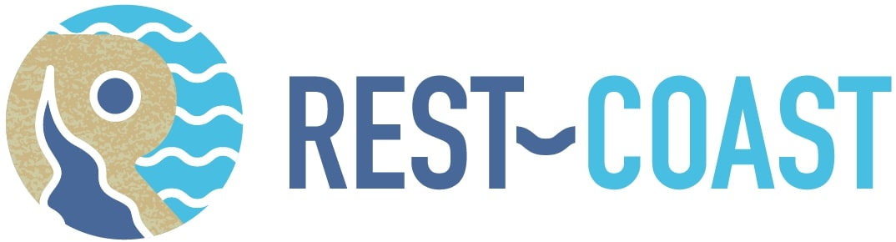

# [🗺️ Interactive Web Map](https://c-arslan-wur.github.io/interactive-web-map/)

This ***Interactive Web Map*** tool is an HTML project based on JavaScript. It incorporates [Leaflet](https://leafletjs.com/) to design an interactive map to streamline the collective application of **the NB3 Building Blocks Framework**. The framework is developed by [Earth Systems and Global Change Group](https://www.wur.nl/en/research-results/chair-groups/environmental-sciences/earth-systems-and-global-change-group.htm) at Wageningen University & Research as part of Task 4.2 in the H2020 [Rest-Coast](https://rest-coast.eu/) project.

 

For detailed information about the framework, please refer to;
- [Nature-based building blocks (NB3) framework for scaling up nature-based solutions in coastal adaptation](https://doi.org/10.1016/j.nbsj.2025.100259)
- [Rest-Coast Deliverable Task 4.2: Framework for co-development of restoration with NBS building blocks & ESS](https://rest-coast.eu/storage/app/uploads/public/67f/653/8eb/67f6538eb6208362862149.pdf)

This tool is founded on the Coastal Units that resulted from the application of the conceptual framework (see Fig 1.) at nine Rest-Coast restoration pilots. Data from these pilot applications are enriched by complementary information from bilateral pilot interactions, plenary meetings, and extended pilot applications. The tool is designed to support participative application of the framework through;
1. Modifying or manipulating the existing Coastal Units and data associated with each unit,
2. Extending the existing data with most recent knowdledge and expertise from the stakeholders,
3. Map new Coastal Units at each pilot by collaboratively applying the framework to identify new Nature-based Building Blocks,
4. Scale-out the application of the framework beyond Rest-Coast by defining new sites and Coastal Units.

This tool is developed by [C. Arslan](mailto:cengiz.arslan@wur.nl) (Wageningen University & Research) to enable effective collaboration among the partners and stakeholders of Task 4.2 in the Rest-Coast project. As part of *the Participative Downscaling Approach* method of the framework, the tool streamlines the process of working together on geospatial data, contributing to stakeholder processes as a co-production tool. So, the design of the tool facilitates participation-based identification of NbS-driven restoration processes as a generic approach beyond the scope Rest-Coast.

***The Interactive Web Map*** tool is a project that is in progress, subject to further development aligned with the needs of and feedback from the users of the tool. It is higly recommended to contact the developer of this script for potential upgrades and improvements in a collaborative manner.

Cengiz Arslan
Earth Systems and Global Change Group
Wageningen University & Research
[e-mail](mailto:cengiz.arslan@wur.nl)

OWNERS:
Cengiz Arslan, PhD Researcher, Wageningen University & Research
Jantsje van Loon-Steensma, Task 4.2 Leader, Wageningen University & Research 
